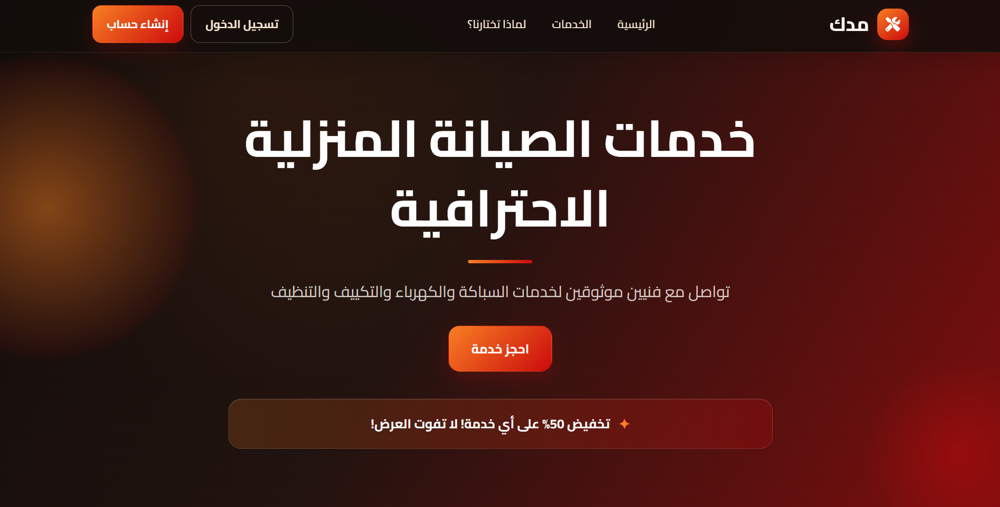

# Mudak - Home Maintenance Services Platform

  

## Academic Project

Mudak is a web-based home maintenance platform developed as an academic project. It connects users with qualified technicians for various home services through a simple and user-friendly interface.

## Features

- User Registration & Login
- Home Maintenance Services
- Technician Profiles
- Service Booking
- Customer Reviews
- Secure Payment Interface
- Responsive Design

## Technologies Used

- HTML5
- CSS3
- JavaScript
- 

## Purpose

The purpose of this project is to provide an easy way for customers to request home maintenance services online while demonstrating front-end web development skills.

## Project Status

Academic Project – Demonstration Prototype
